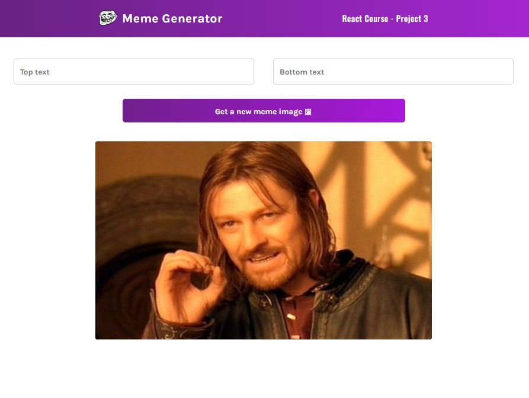

<code>Ver. PT-BR</code>

<h1>Gerador de Meme</h1>

Gerador de Meme foi um projeto desenvolvido durante o curso de React da plataforma Scrimba, tendo como objetivo o aprendizado o use de useState e useEffect.
 

O projeto tem conexão com uma API com 100 imagens de meme famosos e ao clicar no botão <strong>Get a new meme image</strong> é escolhido aleatóriamente uma imagem dentre as existentes no bando de dados.

Após gerar a imagem você pode preencher as inputs acima com as frases que deseja adicionar na imagem, sendo elas no topo da imagem e na parte inferior.

<code>Obs.: Para salvar corretamente nesta versão do projeto a imagem com as frases você deve tirar uma screenshot da imagem.</code>

<code>Ver. ENG</code>

<h1>Meme Generator</h1>

Meme Generator was a project developed during the React course on the Scrimba platform, with the objective of learning how to use useState and useEffect.
 

The project is connected to an API with 100 famous meme images and by clicking on the <strong>Get a new meme image</strong> button, an image is randomly chosen among those existing in the database.

After generating the image, you can fill in the inputs above with the phrases you want to add to the image, being them at the top of the image and at the bottom.

<code>Note: To correctly save the image with the phrases in this version of the project, you must take a screenshot of the image.</code>

